# fan-nginx

### [README.md English version](README_EN.md)

#### 项目介绍

fan-nginx 是一个开源的 Nginx 图形化管理平台. 它基于 Solon 框架和 SQLite 数据库构建, 无需单独安装数据库, 部署后开箱即用.

通过简洁的网页界面, 即可完成 Nginx 的配置与运维管理, 覆盖 Nginx 日常使用约 90% 的配置场景. 未被覆盖的配置项, 可通过自定义参数模板按需生成, 保证配置文件完全可控.

- Github: [https://github.com/meimolihan/fan-nginx](https://github.com/meimolihan/fan-nginx)
- Docker Hub: [https://hub.docker.com/r/mobufan/fan-nginx](https://hub.docker.com/r/mobufan/fan-nginx)

#### 功能特性

- 图形化配置: 在网页中对 Nginx 各项参数进行增删改查, 一键生成 nginx.conf
- 协议转发: 支持 HTTP 协议与 TCP/Stream 协议的转发配置
- 反向代理: 可视化配置 server 项, 支持 SSL、HTTP/2、http 跳转 https
- 负载均衡: 可视化配置 upstream 集群, 并在反向代理中直接引用
- 证书管理: 基于 acme.sh 自动申请、续签 SSL 证书, 支持网页上传 pem/key
- 静态站点: 网页上传 HTML 压缩包到指定路径, 免去命令行上传步骤
- 多机管理: 在一台机器上管理多台 Nginx 服务器, 支持配置一键同步
- 备份回滚: nginx.conf 历史版本备份, 出错时一键回滚
- IP 管控: 支持 HTTP 与 Stream 的 IP 黑白名单配置
- 密码文件: 支持 HTTP Basic Auth 密码文件管理
- API 接口: 内置 smart-doc 接口文档, 便于二次开发与自动化运维

#### 技术说明

- 后端基于 Java 8 与 Solon 框架开发, 默认数据库为 SQLite, 也支持 MySQL、PostgreSQL
- 证书通过 Let's Encrypt + acme.sh 进行自动化申请与续签, 仅支持 Linux 环境签发
- 开启续签的证书每天凌晨 2 点自动检查, 超过 60 天才到期的证书才会续签
- 配置 TCP/Stream 转发时, 高版本 Nginx 的 stream 模块开箱即用; 老版本编译安装 Nginx 时需添加 `--with-stream` 参数
- 未启用 TCP 转发时不会引入 stream 模块配置, 最大限度精简 nginx.conf 


#### jar安装说明
以Ubuntu操作系统为例,

 **注意：本项目需要在root用户下运行系统命令，极容易被黑客利用，请一定修改密码为复杂密码**

1.安装java环境和nginx

Ubuntu:

```
apt update
apt install openjdk-11-jdk
apt install nginx
```

Centos:

```
yum install java-11-openjdk
yum install nginx
```

Windows:

```
下载JDK安装包 https://www.oracle.com/java/technologies/downloads/
下载nginx http://nginx.org/en/download.html
配置JAVA环境变量 
JAVA_HOME : JDK安装目录
Path : JDK安装目录\bin
重启电脑
```


2.下载最新版发行包jar

```
Linux: mkdir /home/fan-nginx/ 
       wget -O /home/fan-nginx/fan-nginx.jar https://github.com/meimolihan/fan-nginx/releases/download/v4.4.2/fan-nginx-4.4.2.jar

Windows: 直接使用浏览器下载 https://github.com/meimolihan/fan-nginx/releases/download/v4.4.2/fan-nginx-4.4.2.jar 到 D:/home/fan-nginx/fan-nginx.jar
```

有新版本只需要修改路径中的版本即可

3.启动程序

```
Linux: nohup java -jar -Dfile.encoding=UTF-8 /home/fan-nginx/fan-nginx.jar --server.port=8080 --project.home=/home/fan-nginx/ > /dev/null &

Windows: java -jar -Dfile.encoding=UTF-8 D:/home/fan-nginx/fan-nginx.jar --server.port=8080 --project.home=D:/home/fan-nginx/
```

参数说明(都是非必填)

--server.port 占用端口, 默认以8080端口启动

--project.home 项目配置文件目录，存放数据库文件，证书文件，日志等, 默认为/home/fan-nginx/

--spring.database.type=mysql 使用其他数据库，不填为使用本地sqlite数据库，可选mysql, postgresql

--spring.datasource.url=jdbc:mysql://ip:port/fan-nginx 数据库url 

--spring.datasource.username=root  数据库用户

--spring.datasource.password=pass  数据库密码

--init.admin=admin 初始用户名

--init.pass=admin 初始用户密码

--init.api=true 初始用户开启api权限

注意Linux命令最后加一个&号, 表示项目后台运行

#### docker安装说明

本项目制作了docker镜像, 支持 x86_64/arm64/arm v7 平台，同时包含nginx和fan-nginx在内, 一体化管理与运行nginx. 

1.安装docker容器环境

Ubuntu:

```
apt install docker.io
```

Centos:

```
yum install docker
```

2.拉取镜像: 

```
docker pull mobufan/fan-nginx:latest
```

3.启动容器: 

```
docker run -itd \
  -v /home/fan-nginx:/home/fan-nginx \
  -e BOOT_OPTIONS="--server.port=8080" \
  --net=host \
  --restart=always \
  mobufan/fan-nginx:latest
```

注意: 

1. 启动容器时请使用--net=host参数, 直接映射本机端口, 因为内部nginx可能使用任意一个端口, 所以必须映射本机所有端口. 

2. 容器需要映射路径/home/fan-nginx:/home/fan-nginx, 此路径下存放项目所有数据文件, 包括数据库, nginx配置文件, 日志, 证书等, 升级镜像时, 此目录可保证项目数据不丢失. 请注意备份.

3. -e BOOT_OPTIONS 参数可填充java启动参数, 可以靠此项参数修改端口号

--server.port 占用端口, 不填默认以8080端口启动

4. 日志默认存放在/home/fan-nginx/log/fan-nginx.log

另: 使用docker-compose时配置文件如下, 项目仓库根目录已内置同款 `docker-compose.yml`, 可直接:

```
docker compose pull
docker compose up -d
```

```
version: "3.2"
services:
  fan-nginx-server:
    image: mobufan/fan-nginx:latest
    volumes:
      - type: bind
        source: "/home/fan-nginx"
        target: "/home/fan-nginx"
    environment:
      BOOT_OPTIONS: "--server.port=8080"
    network_mode: "host"
    restart: always
```


#### 编译说明

使用maven编译打包

```
mvn clean package
```

使用docker构建镜像

```
docker build -t mobufan/fan-nginx:latest .
```

#### 脚本安装（systemd 一键安装/升级）

Linux 服务器推荐使用一键安装脚本，自动完成 jar 部署、nginx 检测/安装、systemd 服务注册、开机自启与防火墙放行。可重复执行，升级等同于重新安装（数据目录自动保留）。

```
# 交互式安装（提示端口、数据目录）
bash scripts/install.sh

# 参数静默安装：端口 + 数据目录，并初始化管理员账号
bash scripts/install.sh -p 8080 -d /var/lib/fan-nginx -u admin -P 123456

# 使用本地已编译好的 jar 安装（无需源码/maven）
bash scripts/install.sh -p 8080 -d /var/lib/fan-nginx -j /tmp/fan-nginx-4.4.2.jar

# 在线下载 GitHub Releases 预编译 jar 安装（默认方式）
bash scripts/install.sh -p 8080 -b

# 国内网络可指定镜像仓库
FAN_NGINX_REPO=https://ghfast.top/https://github.com/meimolihan/fan-nginx.git bash scripts/install.sh -y
```

远程安装（不需要克隆源码到目标服务器，推荐）:

```
# 通过在目标服务器上远程执行 install.sh，自动下载 GitHub Releases 预编译 jar 并安装为 systemd 服务
bash -c "$(curl -sSL https://raw.githubusercontent.com/meimolihan/fan-nginx/main/scripts/install.sh)" -p 8080 -d /var/lib/fan-nginx -u admin -P 你的复杂密码

# 交互式远程安装（会询问端口、数据目录）
bash -c "$(curl -sSL https://raw.githubusercontent.com/meimolihan/fan-nginx/main/scripts/install.sh)"

# 国内网络远程安装（走 GitHub 镜像加速）
FAN_NGINX_REPO=https://ghfast.top/https://github.com/meimolihan/fan-nginx.git bash -c "$(curl -sSL https://raw.githubusercontent.com/meimolihan/fan-nginx/main/scripts/install.sh)" -y
```

远程安装同样会完成 jar 部署、nginx 检测/安装、systemd 服务注册、开机自启、防火墙放行与 CLI 安装，装完后即可在目标机上执行 `fan-nginx status` 确认状态。

安装完成后：

- 数据目录：`/var/lib/fan-nginx`（sqlite.db、nginx 配置、证书、日志等）
- 安装记录：`/etc/fan-nginx.conf`
- systemd 服务：`fan-nginx.service`
- 内置 CLI：`/usr/local/bin/fan-nginx`

卸载：

```
bash scripts/uninstall.sh -y --purge      # 免确认卸载并删除数据目录
bash scripts/uninstall.sh                 # 交互式卸载（默认保留数据目录）
```

#### systemctl 服务管理

```
systemctl start fan-nginx          # 启动
systemctl stop fan-nginx           # 停止
systemctl restart fan-nginx        # 重启
systemctl status fan-nginx         # 状态
systemctl enable fan-nginx         # 开机自启
journalctl -u fan-nginx -f         # 跟踪日志
```

#### 内置 CLI 命令

安装脚本会同时安装一个 `fan-nginx` 命令行工具（等价于 fan-webssh 系列面板的命令风格），无需记住繁琐的 java 命令：

```
fan-nginx status                  # 显示运行方式/systemd状态/PID/端口/访问地址/运行时长/内存/路径
fan-nginx credentials             # 重置并打印全部管理员账号密码（关闭两步验证）
fan-nginx start | stop | restart  # 启停/重启 systemd 服务
fan-nginx uninstall [-y] [--purge|--keep-data]  # 卸载
fan-nginx version                 # 显示版本号
fan-nginx help                    # 显示帮助
```

#### 备份与还原

提供了与面板「备份文件管理」一致的命令行备份/还原脚本（安装时自动部署到 `/var/lib/fan-nginx/scripts`）：

```
# 备份数据目录（默认保留最近 6 份，备份文件 FanNginx-时间戳.tar.gz）
bash /var/lib/fan-nginx/scripts/fan-nginx_backup.sh

# 还原到最近一份备份（会停止服务）
bash /var/lib/fan-nginx/scripts/fan-nginx_recover.sh
```

#### 使用说明

打开 http://xxx.xxx.xxx.xxx:8080 进入主页

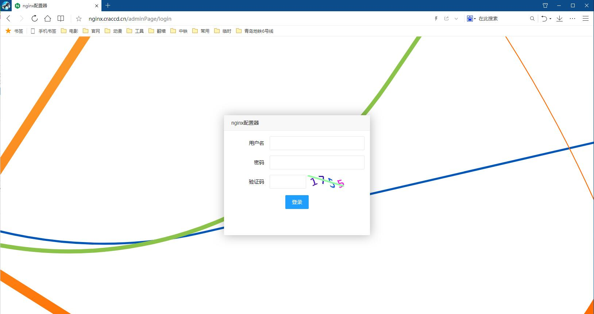

登录页面, 第一次打开会要求初始化管理员账号

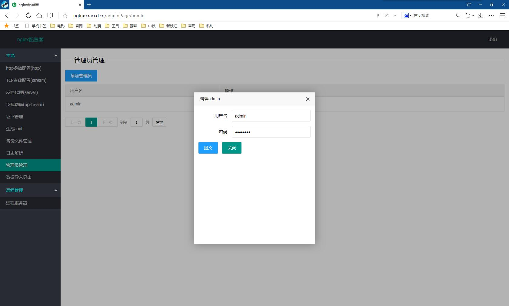

进入系统后, 可在管理员管理里面添加修改管理员账号

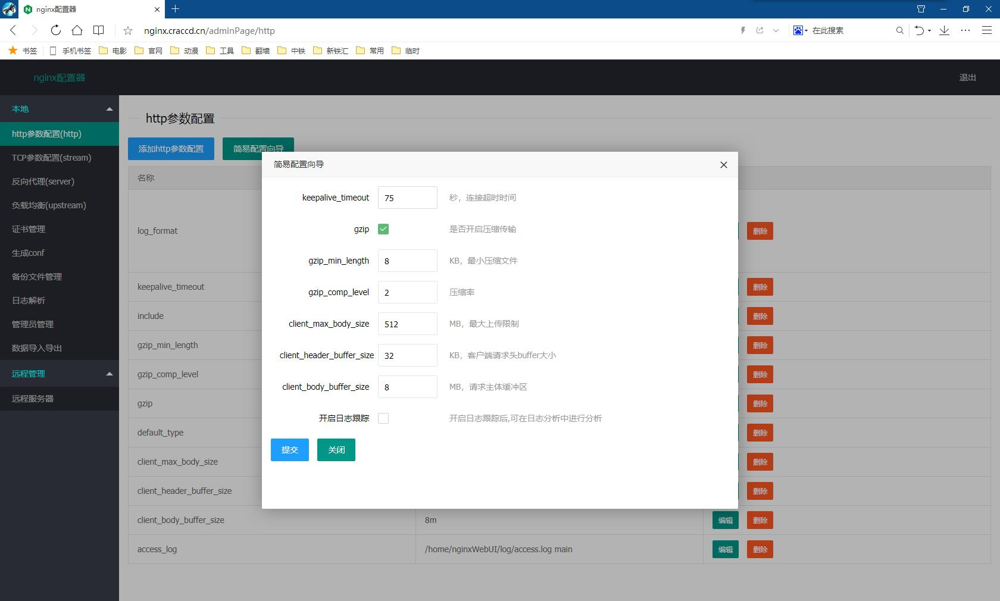

在http参数配置中可以配置nginx的http项目,进行http转发, 默认会给出几个常用配置, 其他需要的配置可自由增删改查. 可以勾选开启日志跟踪, 生成日志文件。

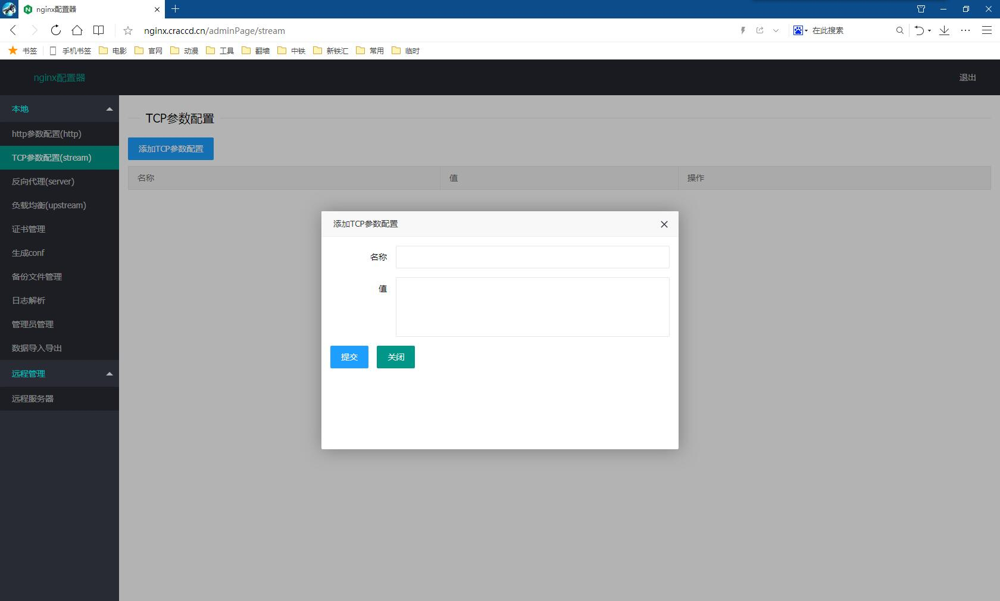

在TCP参数配置中可以配置nginx的stream项目参数, 大多数情况下可不配.

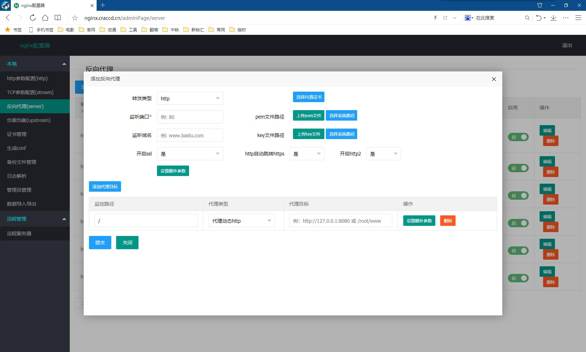

在反向代理中可配置nginx的反向代理即server项功能, 可开启ssl功能, 可以直接从网页上上传pem文件和key文件, 或者使用系统内申请的证书, 可以直接开启http转跳https功能，也可开启http2协议

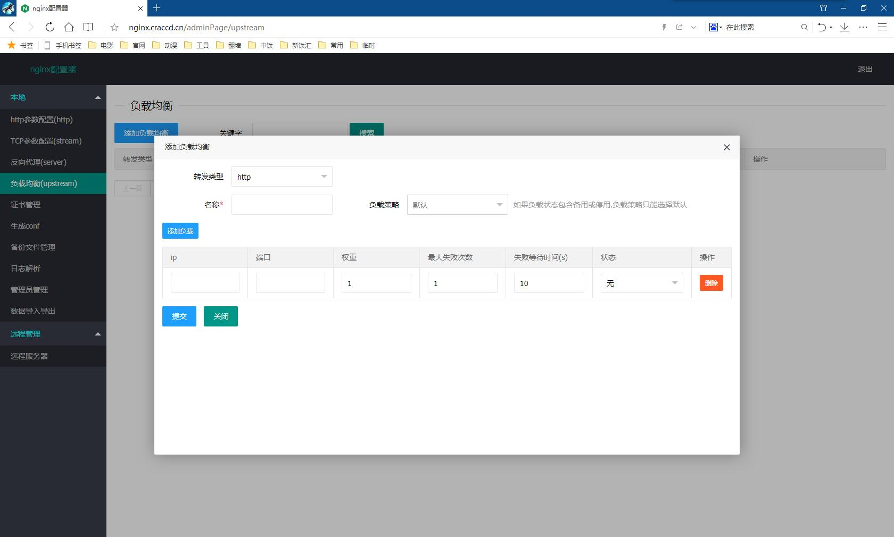

在负载均衡中可配置nginx的负载均衡即upstream项功能, 在反向代理管理中可选择代理目标为配置好的负载均衡

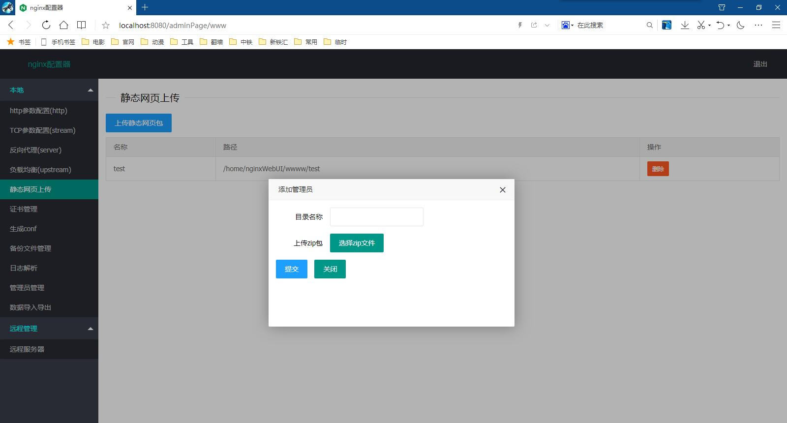

在html静态文件上传中可直接上传html压缩包到指定路径,上传后可直接在反向代理中使用,省去在Linux中上传html文件的步骤

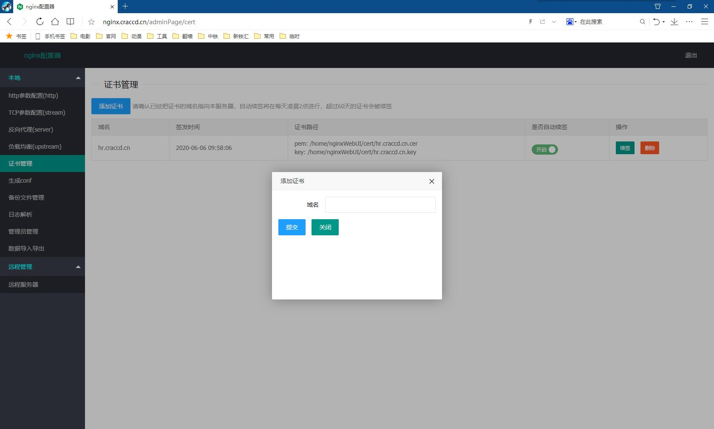

在证书管理中可添加证书, 并进行签发和续签, 开启定时续签后, 系统会自动续签即将过期的证书, 注意:证书的签发是用的acme.sh的dns模式, 需要配合阿里云的aliKey和aliSecret来使用. 请先申请好aliKey和aliSecret

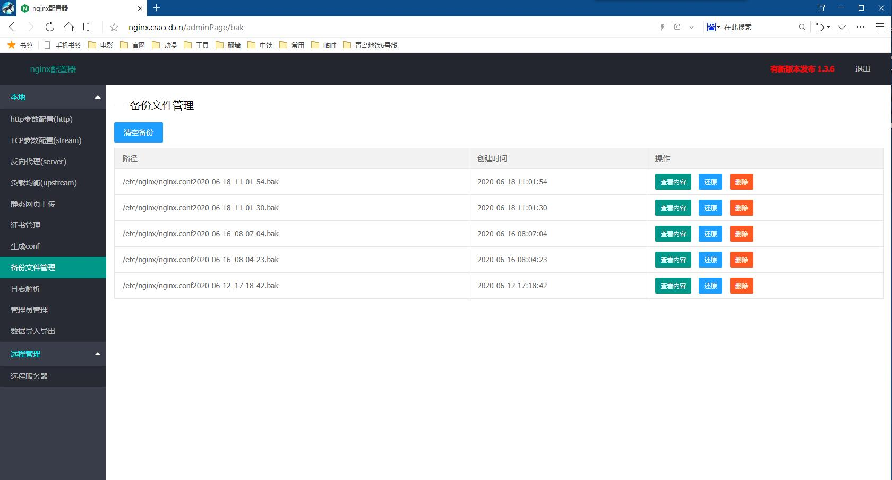

备份文件管理, 这里可以看到nginx.cnf的备份历史版本, nginx出现错误时可以选择回滚到某一个历史版本

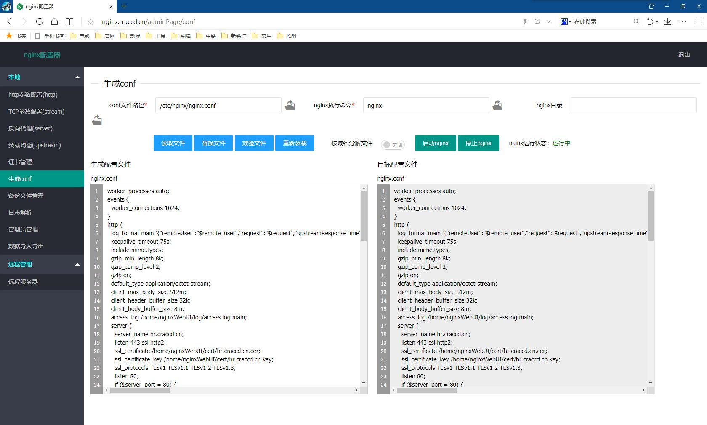

最终生成conf文件,可在此进行进一步手动修改,确认修改无误后,可覆盖本机conf文件,并进行效验和重启, 可以选择生成单一nginx.conf文件还是按域名将各个配置文件分开放在conf.d下
 
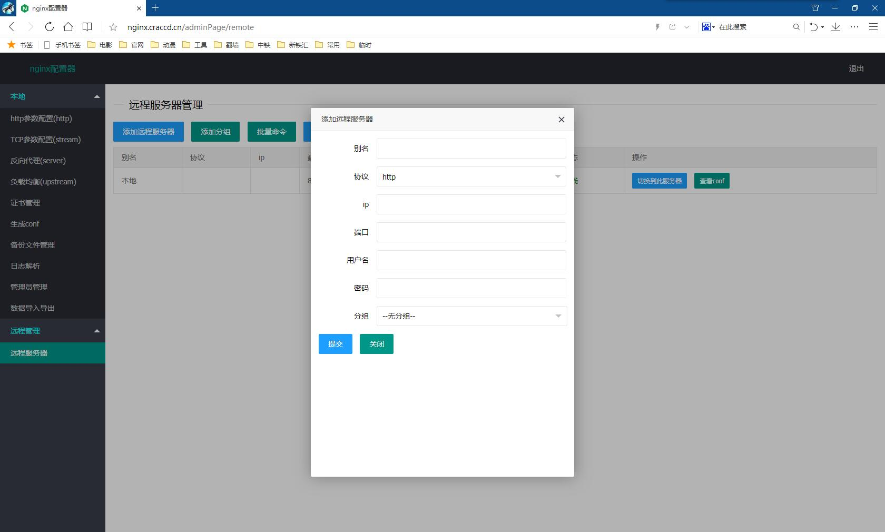

远程服务器管理, 如果有多台nginx服务器, 可以都部署上fan-nginx, 然后登录其中一台, 在远程管理中添加其他服务器的ip和用户名密码, 就可以在一台机器上管理所有的nginx服务器了.

提供一键同步功能, 可以将某一台服务器的数据配置和证书文件同步到其他服务器中

#### 接口开发

本系统提供http接口调用, 打开 http://xxx.xxx.xxx.xxx:8080/doc.html 即可查看smart-doc接口页面.

接口调用需要在http请求header中添加token, 其中token的获取需要先在管理员管理中, 打开用户的接口调用权限, 然后通过用户名密码调用获取token接口, 才能得到token 

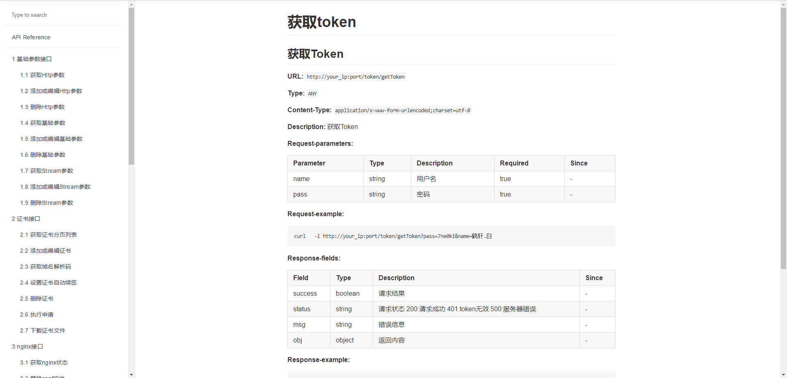

#### 找回密码

如果忘记了登录密码或没有保存两步验证二维码，可按如下教程重置密码和关闭两步验证.

1.脚本安装方式, 直接使用内置 CLI（推荐）

```
fan-nginx credentials
```

等价于执行下面命令，运行成功后即可重置并打印出全部用户名密码并关闭两步验证.

2.jar安装方式, 执行命令

```
java -jar /home/fan-nginx/fan-nginx.jar --project.home=/home/fan-nginx/ --project.findPass=true
```

--project.home 为项目文件所在目录, 使用docker容器时为映射目录

--project.findPass 为是否打印用户名密码

运行成功后即可重置并打印出全部用户名密码并关闭两步验证

3.docker安装方式, 首先执行进入docker容器的命令, 其中{ID}为容器的id

```
docker exec -it {ID} /bin/sh
```

再执行命令

```
java -jar /home/fan-nginx.jar --project.findPass=true
```

运行成功后即可重置并打印出全部用户名密码并关闭两步验证